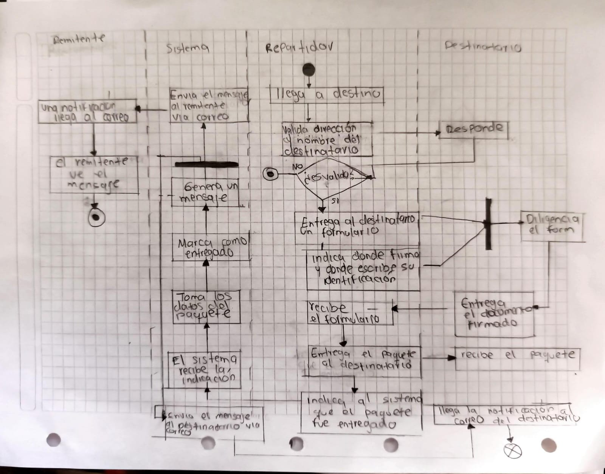

# **Integración con servicios externos - Apache Ni-Fi**

El manejo de grandes cantidades de datos provenientes de diversas fuentes es un desafío complejo, especialmente al intentar conectar estas fuentes y escalar los sistemas de ETL (Extracción, Transformación y Carga). La necesidad de gestionar flujos de datos en tiempo real, asegurar la integridad y seguridad de los datos, y facilitar la integración entre sistemas heterogéneos ha impulsado el desarrollo de soluciones avanzadas para la automatización de flujos de datos.

En este contexto, Apache NiFi emerge como una herramienta poderosa que simplifica y optimiza el flujo de datos, permitiendo a las organizaciones centralizar la administración de datos, reducir tiempos de procesamiento y adaptarse rápidamente a cambios en la infraestructura.

## **¿Que es Apache Ni-fi?**

Apache NiFi es un software low-code, de código abierto mantenido actualmente por la Apache Software Foundation, diseñado para automatizar el intercambio de datos entre sistemas.

Su arquitectura se basa en el concepto de flujos de datos (dataflows), que consisten en una serie de procesos conectados para capturar, procesar y entregar datos de manera eficiente y segura. Estos flujos se configuran a través de una interfaz gráfica intuitiva, lo que reduce la necesidad de escribir código personalizado y acelera el desarrollo de soluciones.

## **Características de Ni-Fi**

**Gestión de flujo:** NiFi garantiza la entrega de datos a gran escala mediante almacenamiento persistente, distribución eficiente de carga y escritura anticipada. Soporta almacenamiento en búfer con contrapresión, priorización de colas y ajustes de QoS para manejar latencia, rendimiento y tolerancia a pérdidas según las necesidades del flujo.

**Facilidad de Uso:** NiFi ofrece una interfaz web intuitiva y de bajo código (low-code) que facilita la creación y gestión de flujos de datos sin necesidad de programar. A través de esta interfaz, los usuarios pueden conectar nodos visualmente, configurar componentes y diseñar flujos de manera sencilla mediante arrastrar y soltar.

**Escalabilidad:** NiFi está diseñado para crecer de manera flexible, permitiendo aumentar la cantidad de tareas en paralelo. Además, permite escalar dinámicamente mediante la configuración de la pestaña Scheduling en cada procesador. También permite clusterizar múltiples instancias de NiFi mediante Zookeeper.

**Extensibilidad:** NiFi está diseñado para ser altamente extensible, permitiendo la creación de componentes personalizados como procesadores y servicios de controlador. Utiliza un modelo de cargador de clases aislado, asegurando que las extensiones no entren en conflicto. Además, su protocolo de comunicación S2S permite transferir datos de manera eficiente y segura entre instancias de NiFi.

# **Arquitectura**

NiFi puede operar de forma clusterizada a partir de la versión 1.0, utilizando el paradigma de agrupación Zero-Leader. En este modelo, cada nodo realiza las mismas tareas con la información ingresada, pero repartida en diferentes nodos.
Cada nodo de nifi corre sobre una JVM en el sistema anfitrión. Y se componen por:

**Web Server:** Expone el api http de NIFI y la interfaz de usuario para gestionar los flujos de datos.

**Flow Controller:** Coordina el procesamiento y distribución de los flujos, tanto los procesadores como las extensiones.

**Extensiones:** Son los componentes que amplían las funcionalidades de NiFi, como los Procesadores, Controladores de servicios, y otros módulos.

**Repositorio de Flowfile:** Rastrea el estado de los FlowFiles, y su ubicación en el flujo de la aplicación.

**Repositorio de Contenido:** Guarda la información real del contenido de los FlowFiles.

**Repositorio de Procedencia**: Guarda los eventos de procedencia, permitiendo la trazabilidad y auditoría de los datos.
# **¿Por qué usar NIFI?**

Nifi es una herramienta muy potente y altamente escalable a la hora de conectar diferentes fuentes de datos, transformarlos y entregarlos a destinos variados. Su capacidad para manejar flujos de datos en tiempo real, junto con una administración visual simplificada, lo convierte en una opción ideal para empresas que buscan automatizar procesos complejos y reducir la intervención manual. Algunas de sus ventajas clave son:

- NiFi ofrece integración con una variedad de orígenes y destinos, como Kafka, RabbitMQ, HTTP, WebSockets, y bases de datos SQL y NoSQL, entre otros. Además, es extensible mediante complementos personalizados.
- Su Repositorio de Procedencia permite visualizar y rastrear el flujo de los datos desde su origen hasta el destino, facilitando auditorías, diagnósticos y cumplimiento normativo.
- NiFi permite conectar múltiples nodos, con la capacidad de escalar horizontalmente para manejar grandes volúmenes de datos. Asimismo, permite ajustar dinámicamente la carga por flujo y proceso, garantizando un procesamiento eficiente y continuo incluso bajo alta demanda.

## **¿Cómo podríamos usar Ni-Fi en este proyecto de paquetes?**

 Cuando el aplicativo se ejecuta en un entorno local y controlado, puede no ser necesario incorporar una herramienta como Apache Ni-Fi, dado que el volumen de datos y la complejidad de integración suelen ser mínimos. Sin embargo, al desplegar el software fuera de un entorno ideal, por ejemplo, en la nube, en múltiples sedes o integrándolo con servicios externos, la operación comienza a exigir capacidades propias de escenarios donde se manejan grandes volúmenes de información, los cuales requieren procesos más robustos para su tratamiento. En este contexto, se vuelve imprescindible disponer de herramientas que permitan organizar, transformar y transferir los datos de forma eficiente y segura.

En este escenario, Apache Ni-Fi se convierte en una solución relevante para proyectos de gestión de paquetes. Este tipo de sistemas requiere procesar información en tiempo real, integrar datos provenientes de múltiples fuentes y garantizar su trazabilidad. Ni-Fi facilita la automatización de flujos de datos, el control del volumen de información y la interconexión entre distintos componentes del sistema, asegurando una transferencia confiable y escalable.  
 Podríamos implementar Ni-Fi de las siguientes formas.

## **Integración de múltiples fuentes de datos**

El sistema puede recibir información de:

- escáneres de códigos QR o códigos de barras,
- sistemas de mensajería,
- aplicaciones móviles de repartidores,
- sensores IoT (por ejemplo, para rastreo GPS),
- bases de datos internas o APIs externas.

Ni-Fi permite unificar todos estos flujos en una sola plataforma.

## **Procesamiento de datos en tiempo real**

A medida que los paquetes cambian de estado (recepción, tránsito, entrega), Ni-Fi puede:

- transformar los datos,
- validar formatos,
- enrutar la información al servicio correspondiente,
- activar notificaciones automáticas.

## **Orquestación del flujo de información**
    

Para evitar cuellos de botella, pérdida de datos o inconsistencias, Ni-Fi administra:

- prioridades de procesamiento,
- almacenamiento temporal (back pressure),
- enrutamiento dinámico según reglas del negocio.

## **Seguridad y trazabilidad**

Ni-Fi registra cada transformación y movimiento de los datos, lo que es esencial para:

- auditorías,
- verificación de historial de paquetes,
- análisis de fallos en el proceso logístico.

## **Escalabilidad del sistema**

A medida que la plataforma crece y recibe más paquetes:

- Ni-Fi se adapta a mayores cargas de trabajo,
- permite añadir nodos de procesamiento sin afectar la operación.
## **Diagrama de Actividades**
- Cuando un paquete se entrega, enviar notificación por email
  

## **Bibliografia**

Quind S.A.S. (2024, 23 de noviembre). Apache NiFi en las Industrias: Transformando la Gestión de Datos y la Integración de Sistemas. Quind. <https://quind.io/blog/desarrollo/apache-nifi-en-las-industrias-transformando-la-gestion-de-datos-y-la-integracion-de-sistemas/>

